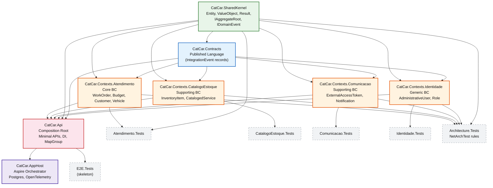

# Project Reference Graph

**Key rules visualized:**

- `CatCar.SharedKernel` depends on **nothing** (pure .NET).
- `CatCar.Contracts` depends **only** on `SharedKernel`.
- Each BC depends on `SharedKernel` + `Contracts` — **never** on another BC.
- `CatCar.Api` (composition root) depends on **all BCs** + `SharedKernel` + `Contracts`.
- `CatCar.AppHost` orchestrates the `Api` project via Aspire project references (no code dependency — coordination is at the process level).
- Test projects depend on their corresponding BC + test infrastructure.
- `Architecture.Tests` depends on **all BCs** + `SharedKernel` (to enforce CON-001 through CON-005).
