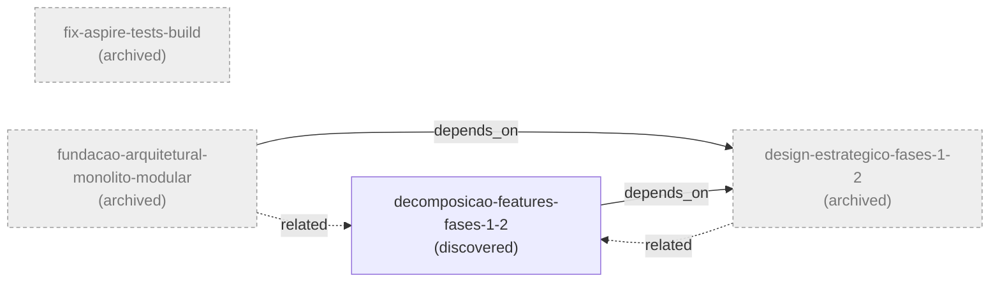

# KB Feature Graph

_Generated by `kb_index` — do not hand-edit. Re-run the tool to refresh._

```mermaid
flowchart LR
  decomposicao_features_fases_1_2["decomposicao-features-fases-1-2<br/>(discovered)"]
  design_estrategico_fases_1_2["design-estrategico-fases-1-2<br/>(archived)"]
  fix_aspire_tests_build["fix-aspire-tests-build<br/>(archived)"]
  fundacao_arquitetural_monolito_modular["fundacao-arquitetural-monolito-modular<br/>(archived)"]
  decomposicao_features_fases_1_2 -->|depends_on| design_estrategico_fases_1_2
  design_estrategico_fases_1_2 -.->|related| decomposicao_features_fases_1_2
  fundacao_arquitetural_monolito_modular -->|depends_on| design_estrategico_fases_1_2
  fundacao_arquitetural_monolito_modular -.->|related| decomposicao_features_fases_1_2
  classDef archived fill:#eeeeee,stroke:#999999,color:#777777,stroke-dasharray: 4 3
  class design_estrategico_fases_1_2,fix_aspire_tests_build,fundacao_arquitetural_monolito_modular archived
```
