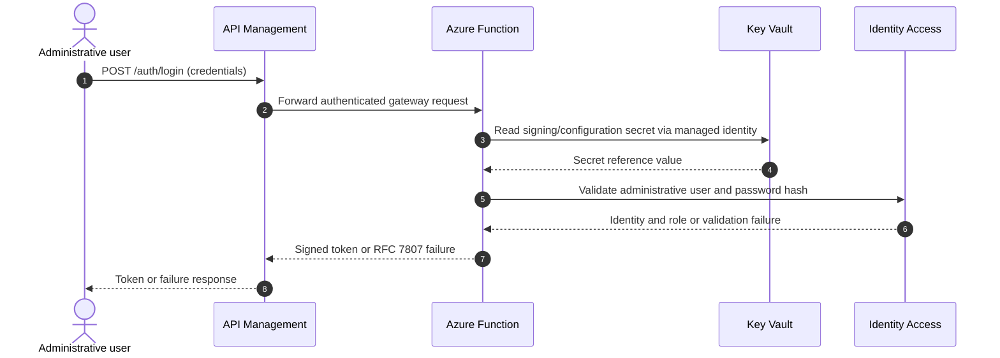
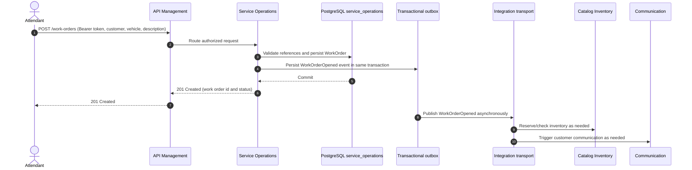

# Authentication and Work Order Opening Sequences

## Administrative authentication

The gateway is the public policy boundary. The Function owns the serverless authentication deployment boundary; secret retrieval is identity-based and no password or signing key is placed in source control. Identity Access remains the authoritative owner of administrative user credentials and roles.

## Work order opening

Opening an OS is synchronous only through the Service Operations transaction. The API returns after the work order and its outbox message commit atomically. Downstream bounded contexts consume the integration event asynchronously, apply idempotent handling, and do not read or write the `service_operations` schema directly. A failed downstream action is retried or compensated by its own consumer rather than rolling back the committed OS.
