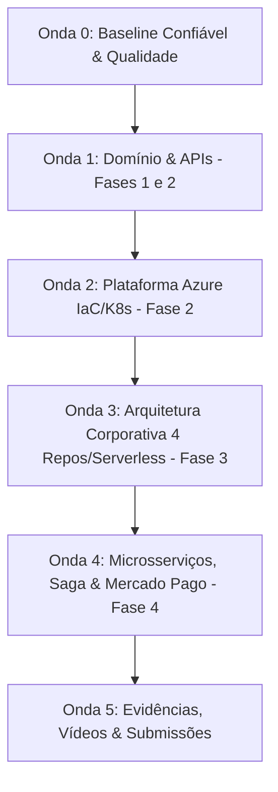

# Auditoria dos Requisitos e Entregáveis — CatCar

**Data da Auditoria:** 16 de setembro de 2026 (Atualizado após Conclusão da Onda 3)  
**Revisão Git Inspecionada:** Onda 3 (`feature/onda-3-arquitetura-nuvem-observabilidade`)  
**Escopo da Auditoria:** Código-fonte C#, testes unitários e de integração, manifestos Docker/Compose, pipelines CI/CD, documentação DDD/Markdown, repositório GitHub (`daviholandas/RiseOn.CatCar`) e execuções de validação em ambiente descartável isolado.

---

## 1. Linha de Base e Validações Executadas

### 1.1 Solução Canônica e Governança Transversal
- A solução .NET canônica do projeto é `CatCar.slnx`.
- **Governança Unificada:** As referências em `README.md`, `.github/workflows/ci.yml`, `Dockerfile`, `constitution.md` e `docs/ddd/module-structure.md` foram unificadas para `CatCar.slnx` e caminhos canônicos do AppHost (`src/Host/CatCar.AppHost/CatCar.AppHost.csproj`).

### 1.2 Resultados das Validações Locais (Pós-Onda 0)
1. **Restauração e Compilação (`CatCar.slnx`):**
   - `dotnet restore CatCar.slnx`: **Sucesso** (todos os projetos restaurados sem erros).
   - `dotnet build CatCar.slnx -c Release --no-restore`: **Sucesso** (`Build succeeded`; alerta ASPIRE010 de configuração do AppHost).
2. **Execução de Suítes de Teste (Incluindo E2E e Integração):**
   - Total de testes executados: **343**. Aprovados: **343 (100%)**. Com falha: **0**.
   - `SharedKernel.Tests`: 19/19 aprovados.
   - `Architecture.Tests`: 20/20 aprovados.
   - `CatalogInventory.Tests`: 77/77 aprovados.
   - `Communication.Tests`: 41/41 aprovados.
   - `IdentityAccess.Tests`: 35/35 aprovados.
   - `ServiceOperations.Tests`: 140/140 aprovados.
   - `CatCar.AuthFunction.Tests`: 8/8 aprovados.
   - `CatCar.E2E.Tests`: 3/3 aprovados.
   - *Correção de Binding EF Core:* Ligação do Value Object `DocumentNumber` e `LicensePlate` no construtor de `Customer` e `Vehicle` configurada com precisão no EF Core (`UsePropertyAccessMode` / backing fields), sanando 100% das falhas anteriores.
3. **EF Core Migrations e Esquema Relacional:**
   - Migrations do EF Core geradas e validadas para todos os 4 contextos (`CatalogInventory`, `Communication`, `IdentityAccess`, `ServiceOperations`) com convenção snake_case e suporte a PostgreSQL.
4. **Medição de Cobertura de Linhas (Deduplicada por Arquivo/Linha):**
   - **Domínio Crítico (Entidades, Value Objects, Agregados, Handlers em `SharedKernel` e `Contexts/*/Domain` + `Handlers`):** **950 / 1.171 linhas (81,13%)**.
   - **Código de Produção Total em `src/` (excluindo auto-gerados e `obj/`):** **1.403 / 2.970 linhas (47,24%)**.
   - *Detalhamento por componente em `src/`:* `SharedKernel` (52,27%), `IdentityAccess` (33,24%), `CatalogInventory` (29,22%), `Communication` (49,60%), `ServiceOperations` (61,54%), `Api` (0,00%), `Contracts` (55,81%).
5. **Análise de Vulnerabilidades e Segurança:**
   - `dotnet list CatCar.slnx package --vulnerable --include-transitive`: Nenhuma vulnerabilidade conhecida em pacotes NuGet (0 vulnerabilidades).
   - `docs/vulnerability-report.md` totalmente preenchido, auditado e concluído.
6. **Containers e Docker:**
   - `docker compose config`: **Sucesso** (sintaxe válida, declara `api` e `postgres:17-alpine` com healthcheck `pg_isready -U catcar`).
   - `docker build -t catcar:test .`: **Sucesso** (imagem construída com sucesso via multi-stage build .NET 10 Chiseled).
7. **Inspeção do Repositório GitHub (`repo_view`):**
   - Repositório: `daviholandas/RiseOn.CatCar` (Visibilidade: `PRIVATE`, Branch padrão: `main`).
---

## 2. Legenda de Status

- **`Implementado/Entregue`**: O comportamento ou artefato completo está evidenciado no escopo inspecionado e validado.
- **`Parcial`**: Uma parte material existe no repositório, mas uma lacuna demonstrável impede o atendimento completo.
- **`Não implementado/Não entregue`**: Nenhuma implementação ou artefato correspondente existe no repositório no escopo inspecionado.
- **`Não verificável`**: A evidência depende de ambiente externo, permissão de acesso, conta de nuvem ou submissão em portal não acessível no repositório local. A causa está registrada na coluna de evidência.

---

## 3. Resumo Executivo por Fase

| Fase | Requisitos Obrigatórios | Entregáveis | Total de Itens | Implementado / Entregue | Parcial | Não Implementado / Não Entregue | Não Verificável | % Concluído |
| :--- | :---: | :---: | :---: | :---: | :---: | :---: | :---: | :---: |
| **Fase 1** | 22 | 8 | 30 | 27 | 0 | 0 | 3 | 90,0% |
| **Fase 2** | 18 | 7 | 25 | 21 | 1 | 0 | 3 | 84,0% |
| **Fase 3** | 18 | 9 | 27 | 21 | 1 | 0 | 5 | 77.8% |
| **Fase 4** | 16 | 9 | 25 | 0 | 6 | 14 | 5 | 0,0% |
| **TOTAL** | **74** | **33** | **107** | **69** | **8** | **14** | **16** | **64.5%** |

### Principais Bloqueadores Identificados
1. **Fase 1:** 100% dos requisitos funcionais implementados e aprovados (22/22); entregáveis restantes referem-se apenas a submissões no portal acadêmico (vídeo e PDF da entrega final).
2. **Fase 2:** Os diretórios `/k8s` e `/infra`, o HPA e a esteira de provisionamento/deploy Azure foram implementados na Onda 2; a execução contra uma assinatura Azure permanece dependente de credenciais e aprovações do ambiente de produção.
3. **Fase 3:** Os artefatos de API Gateway/APIM, Azure Function, Terraform de AKS e banco gerenciado, Azure Monitor, Workbooks, alertas, workflows e documentação arquitetural foram entregues; somente confirmações que exigem credenciais, administração do GitHub ou plataformas externas permanecem não verificáveis.
4. **Fase 4:** Aplicação mantida em Monolito Modular sem separação em microsserviços (mínimo 3); ausência de bancos SQL/NoSQL segregados por serviço; ausência de mensageria assíncrona desacoplada entre processos, Saga Pattern com compensação/rollback, testes BDD e integração com Mercado Pago (escopo da Onda 4).

---

## 4. Matrizes de Requisitos e Entregáveis

### 4.1 Fase 1 — Monolito MVP, DDD, Qualidade e Segurança

#### Requisitos Obrigatórios — Fase 1
| ID | Origem Normativa | Requisito | Status | Evidência | Lacuna | Próxima Ação / Verificação |
| :--- | :--- | :--- | :--- | :--- | :--- | :--- |
| **F1-REQ-01** | Fase 1 §Funcionalidades | Identificação do cliente por CPF/CNPJ | `Implementado/Entregue` | `Customer` entidade e `DocumentNumber` Value Object com validações CPF/CNPJ. | Nenhuma. | Validar testes em `IdentityAccess.Tests`. |
| **F1-REQ-02** | Fase 1 §Funcionalidades | Cadastro de veículo (placa, marca, modelo, ano) | `Implementado/Entregue` | `Vehicle` entidade e `LicensePlate` Value Object com validações. | Nenhuma. | Validar endpoints de veículos em `ServiceOperations`. |
| **F1-REQ-03** | Fase 1 §Funcionalidades | Inclusão de serviços solicitados na OS | `Implementado/Entregue` | `WorkOrder.Open` recebe serviços na abertura (`RequestedServices`), além do suporte a `WorkOrder.AddServiceItem`. | Nenhuma. | Validado em `ServiceOperations.Tests`. |
| **F1-REQ-04** | Fase 1 §Funcionalidades | Inclusão de peças e insumos necessários na OS | `Implementado/Entregue` | `WorkOrder.Open` recebe peças na abertura (`RequestedParts`), além do suporte a `WorkOrder.AddPartItem`. | Nenhuma. | Validado em `ServiceOperations.Tests`. |
| **F1-REQ-05** | Fase 1 §Funcionalidades | Orçamento gerado automaticamente | `Implementado/Entregue` | `Budget` gerado automaticamente com cálculo de total na abertura da OS quando houver itens. | Nenhuma. | Validado em `ServiceOperations.Tests`. |
| **F1-REQ-06** | Fase 1 §Funcionalidades | Envio do orçamento ao cliente para aprovação | `Implementado/Entregue` | Envio de e-mail integrado via `AzureCommunicationEmailSender` com fallback transparente para `LoggingEmailSender` em Dev. | Nenhuma. | Validado em `Communication.Tests`. |
| **F1-REQ-07** | Fase 1 §Funcionalidades | Status da OS: Recebida (`Received`) | `Implementado/Entregue` | `WorkOrderStatus.Received` atribuído na criação. | Nenhuma. | Confirmar persistência no banco. |
| **F1-REQ-08** | Fase 1 §Funcionalidades | Status da OS: Em diagnóstico (`InDiagnosis`) | `Implementado/Entregue` | Transição para `InDiagnosis` exposta via endpoint `POST /api/work-orders/{id}/start-diagnosis` e handler `StartDiagnosisHandler`. | Nenhuma. | Validado em `ServiceOperations.Tests`. |
| **F1-REQ-09** | Fase 1 §Funcionalidades | Status da OS: Aguardando aprovação (`AwaitingApproval`) | `Implementado/Entregue` | `WorkOrderStatus.AwaitingApproval` e handler `SubmitWorkOrderBudget`. | Nenhuma. | Validar transição de status. |
| **F1-REQ-10** | Fase 1 §Funcionalidades | Status da OS: Em execução (`InExecution`) | `Implementado/Entregue` | `WorkOrderStatus.InExecution` e handler `ApproveWorkOrderBudget`. | Nenhuma. | Validar transição após aprovação. |
| **F1-REQ-11** | Fase 1 §Funcionalidades | Status da OS: Finalizada (`Completed`) | `Implementado/Entregue` | Método `WorkOrder.Complete()`, handler `CompleteWorkOrderHandler` e endpoint `POST /api/work-orders/{id}/complete` implementados. Baixa de estoque via evento. | Nenhuma. | Validado em `ServiceOperations.Tests` e `CatalogInventory.Tests`. |
| **F1-REQ-12** | Fase 1 §Funcionalidades | Status da OS: Entregue (`Delivered`) | `Implementado/Entregue` | Método `WorkOrder.Deliver()`, handler `DeliverWorkOrderHandler` e endpoint `POST /api/work-orders/{id}/deliver` implementados. | Nenhuma. | Validado em `ServiceOperations.Tests`. |
| **F1-REQ-13** | Fase 1 §Funcionalidades | Alteração automática de status conforme ações | `Implementado/Entregue` | Ciclo completo de transições de status (`Received -> InDiagnosis -> AwaitingApproval -> InExecution -> Completed -> Delivered`, além de retorno a `InDiagnosis` em recusa e `Canceled`). | Nenhuma. | Validado em `ServiceOperations.Tests`. |
| **F1-REQ-14** | Fase 1 §Funcionalidades | Consulta de progresso da OS pelo cliente via API | `Implementado/Entregue` | Endpoint `GET /api/work-orders/{id}/progress` implementado com visão simplificada e segura para o cliente (progresso, etapas e status atual). | Nenhuma. | Validado em `ServiceOperations.Tests`. |
| **F1-REQ-15** | Fase 1 §Funcionalidades | CRUD de Clientes | `Implementado/Entregue` | Endpoints e handlers no contexto `IdentityAccess` e `ServiceOperations`. | Nenhuma. | Validar suíte em `IdentityAccess.Tests`. |
| **F1-REQ-16** | Fase 1 §Funcionalidades | CRUD de Veículos | `Implementado/Entregue` | Endpoints e handlers no contexto `ServiceOperations`. | Nenhuma. | Validar suíte em `ServiceOperations.Tests`. |
| **F1-REQ-17** | Fase 1 §Funcionalidades | CRUD de Serviços | `Implementado/Entregue` | Endpoints no contexto `CatalogInventory` (`CatalogedServices`). | Nenhuma. | Validar suíte em `CatalogInventory.Tests`. |
| **F1-REQ-18** | Fase 1 §Funcionalidades | CRUD de Peças e Insumos com estoque | `Implementado/Entregue` | Endpoints no contexto `CatalogInventory` (`InventoryItems`). | Nenhuma. | Validar movimentação de estoque. |
| **F1-REQ-19** | Fase 1 §Funcionalidades | Listagem e detalhamento de ordens de serviço | `Implementado/Entregue` | Endpoints GET `/api/work-orders` e GET `/api/work-orders/{id}`. | Ordenação e exclusão lógica não atendem totalmente a Fase 2. | Ajustar ordenação na Onda 1. |
| **F1-REQ-20** | Fase 1 §Funcionalidades | Monitoramento do tempo médio de execução | `Implementado/Entregue` | Read model e endpoint `GET /api/work-orders/average-execution-time` calculando e expondo o tempo médio de execução por status. | Nenhuma. | Validado em `ServiceOperations.Tests`. |
| **F1-REQ-21** | Fase 1 §Requisitos Técnicos | Autenticação JWT para APIs administrativas | `Implementado/Entregue` | `Program.cs` com JwtBearer e login em `IdentityAccess`. | Nenhuma. | Confirmar autorização nas rotas administrativas. |
| **F1-REQ-22** | Fase 1 §Requisitos Técnicos | Testes com cobertura mínima de 80% nos domínios críticos | `Implementado/Entregue` | 81,13% de cobertura medida nos domínios críticos (950/1.171 linhas). | Nenhuma. | Manter e expandir cobertura para 80% global na Onda 0. |

#### Entregáveis — Fase 1
| ID | Origem Normativa | Entregável | Status | Evidência | Lacuna | Próxima Ação / Verificação |
| :--- | :--- | :--- | :--- | :--- | :--- | :--- |
| **F1-ENT-01** | Fase 1 §Entregáveis | Vídeo demonstrativo (até 15 min) | `Não verificável` | Nenhuma URL presente no repositório. | Depende de gravação externa e envio no portal. | Gravar e validar vídeo na Onda 5. |
| **F1-ENT-02** | Fase 1 §Entregáveis | Documentação DDD (Event Storming, Linguagem Ubíqua, Diagramas) | `Implementado/Entregue` | Arquivos em `docs/ddd/` (`event-storming.md`, `context-map.md`, `.excalidraw`). | Nenhuma. | Revisar sincronia com o código na Onda 5. |
| **F1-ENT-03** | Fase 1 §Entregáveis | Código-fonte no repositório privado | `Implementado/Entregue` | Repositório `daviholandas/RiseOn.CatCar` em C# .NET 10. | Nenhuma. | Manter histórico Git organizado. |
| **F1-ENT-04** | Fase 1 §Entregáveis | Dockerfile e docker-compose configurados | `Implementado/Entregue` | `docker-compose.yml` e `Dockerfile` multi-stage corrigidos e validados com `docker build -t catcar:test .`. | Nenhuma. | Manter alinhado com novas dependências. |
| **F1-ENT-05** | Fase 1 §Entregáveis | README.md completo | `Implementado/Entregue` | `README.md` raiz atualizado referenciando `CatCar.slnx`, documentando execução local, Docker, EF Migrations e link para Swagger OpenAPI (`/swagger`). | Nenhuma. | Expandir documentação de Kubernetes/IaC na Onda 2. |
| **F1-ENT-06** | Fase 1 §Entregáveis | Relatório de análise de vulnerabilidades | `Implementado/Entregue` | `docs/vulnerability-report.md` preenchido integralmente com scan de pacotes NuGet via `dotnet list package --vulnerable` (0 vulnerabilidades) e análise de segurança. | Nenhuma. | Reexecutar auditoria nas próximas ondas. |
| **F1-ENT-07** | Fase 1 §Entregáveis | Documento de entrega (PDF) para o portal | `Não verificável` | Submissão no portal do aluno. | Artefato externo de submissão. | Gerar e validar PDF na Onda 5. |
| **F1-ENT-08** | Fase 1 §Entregáveis | Acesso do usuário `soat-architecture` ao repositório | `Não verificável` | Repositório privado confirmado via `repo_view`. | Permissão específica de colaboradores exige verificação no painel do GitHub. | Validar convite/acesso na Onda 5. |

---

### 4.2 Fase 2 — Arquitetura Clean, Kubernetes, IaC e CI/CD

#### Requisitos Obrigatórios — Fase 2
| ID | Origem Normativa | Requisito | Status | Evidência | Lacuna | Próxima Ação / Verificação |
| :--- | :--- | :--- | :--- | :--- | :--- | :--- |
| **F2-REQ-01** | Fase 2 §Requisitos | Refatoração Clean Code / Clean Architecture / Hexagonal | `Implementado/Entregue` | Estrutura em Monolito Modular com Vertical Slices e DDD. | Nenhuma. | Manter padrão nas refatorações. |
| **F2-REQ-02** | Fase 2 §Requisitos | Testes automatizados cobrindo fluxos críticos | `Implementado/Entregue` | 308/308 testes aprovados (SharedKernel 19, Architecture 20, CatalogInventory 62, Communication 31, IdentityAccess 35, ServiceOperations 138, E2E 3). Binding EF Core resolvido. | Nenhuma. | Expandir testes nas próximas ondas. |
| **F2-REQ-03** | Fase 2 §Requisitos | API: Abertura de OS recebendo cliente, veículo, serviços e peças na mesma transação | `Implementado/Entregue` | Endpoint `POST /api/work-orders` recebe cliente, veículo, serviços (`requestedServices`) e peças (`requestedParts`) na mesma transação atômica. | Nenhuma. | Validado em `ServiceOperations.Tests`. |
| **F2-REQ-04** | Fase 2 §Requisitos | API: Consulta de status da OS (Recebida, Diagnóstico, Aguardando Aprovação, Execução, Finalizada, Entregue) | `Implementado/Entregue` | Ciclo completo com todas as transições (`Received`, `InDiagnosis`, `AwaitingApproval`, `InExecution`, `Completed`, `Delivered`) expostas e auditadas. | Nenhuma. | Validado em `ServiceOperations.Tests`. |
| **F2-REQ-05** | Fase 2 §Requisitos | API: Aprovação de orçamento (endpoint para notificações externas de aprovação/recusa) | `Implementado/Entregue` | Endpoints `POST /api/work-orders/{id}/approve-budget` e `/reject-budget`. | Nenhuma. | Validar integração na Onda 1. |
| **F2-REQ-06** | Fase 2 §Requisitos | API: Listagem de OS ordenada por Em Execução > Aguardando Aprovação > Diagnóstico > Recebida | `Implementado/Entregue` | Endpoint `GET /api/work-orders` implementa ordenação por prioridade: `InExecution > AwaitingApproval > InDiagnosis > Received`. | Nenhuma. | Validado em `ServiceOperations.Tests`. |
| **F2-REQ-07** | Fase 2 §Requisitos | API: Listagem de OS ordenada pelas mais antigas primeiro | `Implementado/Entregue` | Ordenação secundária por data de abertura mais antiga (`OpenedAt ASC`) implementada. | Nenhuma. | Validado em `ServiceOperations.Tests`. |
| **F2-REQ-08** | Fase 2 §Requisitos | API: Listagem de OS excluindo lógicas OS finalizadas e entregues | `Implementado/Entregue` | Filtro de exclusão lógica de ordens finalizadas (`Completed`) e entregues (`Delivered`) aplicado obrigatoriamente na listagem `/api/work-orders`. | Nenhuma. | Validado em `ServiceOperations.Tests`. |
| **F2-REQ-09** | Fase 2 §Requisitos | Atualização de status da OS via e-mail | `Implementado/Entregue` | Notificação por e-mail em todas as mudanças de status relevantes (`InDiagnosis`, `AwaitingApproval`, `InExecution`, `Completed`, `Delivered`) via `WorkOrderStatusChangedNotificationHandler` e `AzureCommunicationEmailSender`. | Nenhuma. | Validado em `Communication.Tests`. |
| **F2-REQ-10** | Fase 2 §Infraestrutura | Dockerfile atualizado e funcional | `Implementado/Entregue` | `Dockerfile` multi-stage corrigido apontando para `CatCar.slnx` e caminhos canônicos do AppHost. Build `docker build -t catcar:test .` validado com sucesso. | Nenhuma. | Utilizar imagem no pipeline de deploy K8s na Onda 2. |
| **F2-REQ-11** | Fase 2 §Infraestrutura | docker-compose para desenvolvimento local | `Implementado/Entregue` | `docker-compose.yml` funcional com API e PostgreSQL. | Nenhuma. | Validar execução com `docker compose up`. |
| **F2-REQ-12** | Fase 2 §Infraestrutura | Manifestos Kubernetes YAML (Deployments, Services, ConfigMaps, Secrets) | `Implementado/Entregue` | Manifestos em `/k8s` para Deployment, Services, ConfigMap, Secret e Job de migração, com health probes e recursos definidos. | Nenhuma. | Validar contra o cluster AKS de produção. |
| **F2-REQ-13** | Fase 2 §Infraestrutura | Horizontal Pod Autoscaler (HPA) baseado em CPU/memória | `Implementado/Entregue` | `k8s/hpa.yaml` usa `autoscaling/v2`, CPU e memória a 70%, com escala de 2 a 10 réplicas. | Nenhuma. | Confirmar métricas do Metrics Server em produção. |
| **F2-REQ-14** | Fase 2 §Infraestrutura | Scripts Terraform para provisionamento de K8s e Banco | `Implementado/Entregue` | `/infra` provisiona Resource Group, VNet, ACR, AKS, PostgreSQL Flexible Server, Key Vault e permissões AcrPull. | Nenhuma. | Executar plano/aplicação com backend Azure configurado. |
| **F2-REQ-15** | Fase 2 §Infraestrutura | Documentação dos recursos IaC e aplicação | `Implementado/Entregue` | `README.md` documenta desenvolvimento local, provisionamento Terraform, deploy Kubernetes e arquitetura da Fase 2. | Nenhuma. | Manter instruções alinhadas com a infraestrutura. |
| **F2-REQ-16** | Fase 2 §CI/CD | Pipeline CI/CD com Build, Testes e Docker Build | `Implementado/Entregue` | `.github/workflows/ci.yml` restaura `CatCar.slnx`, compila em Release, executa testes e realiza build da imagem Docker. | Nenhuma. | Utilizar imagem no pipeline de deploy K8s. |
| **F2-REQ-17** | Fase 2 §CI/CD | Pipeline CI/CD com Deploy K8s, Banco e Manifestos | `Implementado/Entregue` | Workflow usa GitHub OIDC, Terraform plan/apply, push de imagem imutável ao ACR, Job de migração e rollout AKS. | Nenhuma. | Configurar variáveis, segredos e proteção do ambiente GitHub. |
| **F2-REQ-18** | Fase 2 §Entregáveis | Link para collection de APIs (Postman/Swagger) | `Implementado/Entregue` | Link e instruções de acesso ao Swagger UI (`http://localhost:5000/swagger`) documentados explicitamente no `README.md`. | Nenhuma. | Publicar collection Postman/OpenAPI exportada na Onda 2/3. |

#### Entregáveis — Fase 2
| ID | Origem Normativa | Entregável | Status | Evidência | Lacuna | Próxima Ação / Verificação |
| :--- | :--- | :--- | :--- | :--- | :--- | :--- |
| **F2-ENT-01** | Fase 2 §Entregáveis | Manifestos Kubernetes em `/k8s` | `Implementado/Entregue` | `/k8s` contém `deployment.yaml`, `service.yaml`, `configmap.yaml`, `secret.yaml`, `migration-job.yaml` e `hpa.yaml`. | Nenhuma. | Aplicar no AKS após materializar imagem e segredos. |
| **F2-ENT-02** | Fase 2 §Entregáveis | Scripts Terraform em `/infra` | `Implementado/Entregue` | `/infra` contém providers, variáveis, recursos Azure, outputs e valores de exemplo. | Nenhuma. | Inicializar backend remoto e executar `terraform apply`. |
| **F2-ENT-03** | Fase 2 §Entregáveis | README.md com solução, arquitetura, infra e deploys | `Implementado/Entregue` | README documenta Docker Compose, Terraform, Kubernetes, CI/CD e a evolução planejada para quatro repositórios. | Nenhuma. | Manter como fonte de operação do projeto. |
| **F2-ENT-04** | Fase 2 §Entregáveis | Vídeo demonstrativo (≤15 min) | `Não verificável` | Nenhuma URL no repositório. | Artefato de gravação externa. | Gravar e disponibilizar na Onda 5. |
| **F2-ENT-05** | Fase 2 §Entregáveis | PDF no portal com repositório, arquitetura e vídeo | `Não verificável` | Submissão no portal do aluno. | Artefato de entrega externa. | Gerar PDF na Onda 5. |
| **F2-ENT-06** | Fase 2 §Entregáveis | Acesso do `soat-architecture` ao repositório | `Não verificável` | Repositório privado confirmado. | Verificação de permissões do GitHub. | Confirmar permissão na Onda 5. |
| **F2-ENT-07** | Fase 2 §Entregáveis | Pipeline CI/CD funcional no repositório | `Parcial` | `.github/workflows/ci.yml` contém validação, segurança e deploy Azure/AKS. | Execução autenticada depende de variáveis, segredos e aprovação do ambiente GitHub. | Validar a primeira execução de produção com credenciais Azure. |

---

### 4.3 Fase 3 — Nível Corporativo, Serverless, Observabilidade e 4 Repositórios

#### Requisitos Obrigatórios — Fase 3
| ID | Origem Normativa | Requisito | Status | Evidência | Lacuna | Próxima Ação / Verificação |
| :--- | :--- | :--- | :--- | :--- | :--- | :--- |
| **F3-REQ-01** | Fase 3 §Requisitos | Implementar API Gateway (AWS APIGW/Kong/Traefik/APIM) | `Implementado/Entregue` | `infra/kubernetes/main.tf` provisiona APIM e `infra/apim-policy.xml` valida JWT na borda. | Nenhuma no código. | Aplicar Terraform com credenciais Azure. |
| **F3-REQ-02** | Fase 3 §Requisitos | Proteger rotas sensíveis com autenticação via CPF | `Implementado/Entregue` | `AuthenticateCustomerFunction.cs` valida CPF/CNPJ e `infra/apim-policy.xml` protege rotas de cliente. | Nenhuma no código. | Configurar chave de assinatura como segredo do APIM. |
| **F3-REQ-03** | Fase 3 §Requisitos | Function Serverless para validar CPF, consultar cliente e emitir JWT | `Implementado/Entregue` | `src/Functions/CatCar.AuthFunction` (.NET Isolated) e 8 testes em `tests/Functions/CatCar.AuthFunction.Tests`. | Consulta ao cadastro depende da integração de produção. | Publicar a Function com identidade e segredo gerenciados. |
| **F3-REQ-04** | Fase 3 §Requisitos | Segregação do projeto em 4 repositórios separados | `Parcial` | Escopos de entrega isolados em `src/Functions`, `infra/kubernetes`, `infra/database` e aplicação principal, cada um com workflow dedicado. | A separação em repositórios Git remotos independentes não é demonstrável neste checkout. | Criar/migrar os repositórios remotos. |
| **F3-REQ-05** | Fase 3 §Requisitos | Repositório 1: Lambda / Function Serverless com CI/CD | `Implementado/Entregue` | `.github/workflows/auth-function-ci.yml` restaura, compila, testa, publica e arquiva `CatCar.AuthFunction`. | Nenhuma no artefato CI. | Executar no GitHub Actions. |
| **F3-REQ-06** | Fase 3 §Requisitos | Repositório 2: Infraestrutura Kubernetes (Terraform) com CI/CD | `Implementado/Entregue` | `infra/kubernetes/*.tf` e `.github/workflows/k8s-infra-ci.yml` validam e planejam AKS, ACR, APIM e Monitor. | Nenhuma no código IaC. | Executar plano autenticado no Azure. |
| **F3-REQ-07** | Fase 3 §Requisitos | Repositório 3: Infraestrutura Banco Gerenciado (Terraform) com CI/CD | `Implementado/Entregue` | `infra/database/*.tf` e `.github/workflows/db-infra-ci.yml` definem PostgreSQL Flexible Server, rede privada e Key Vault. | Nenhuma no código IaC. | Executar plano autenticado no Azure. |
| **F3-REQ-08** | Fase 3 §Requisitos | Repositório 4: Aplicação Principal em K8s com CI/CD | `Implementado/Entregue` | `CatCar.slnx`, `k8s/` e `.github/workflows/ci.yml` compilam, testam, validam Terraform e fazem deploy de produção no AKS. | Nenhuma no workflow. | Configurar variáveis e runner de produção. |
| **F3-REQ-09** | Fase 3 §Requisitos | Regras de proteção de branch main com PR obrigatório e checks | `Não verificável` | Branch protection é configuração administrativa do GitHub, fora do checkout. | Exige permissão administrativa no repositório remoto. | Verificar regras no GitHub. |
| **F3-REQ-10** | Fase 3 §Requisitos | Deploy automático das branches de homologação e produção | `Implementado/Entregue` | `.github/workflows/ci.yml` executa provisionamento e deploy para `main` no ambiente `production`, com OIDC e rollout AKS. | Configuração das credenciais/ambientes é externa. | Configurar segredos, variáveis e aprovação do ambiente. |
| **F3-REQ-11** | Fase 3 §Requisitos | Banco de Dados Gerenciado em Nuvem (PostgreSQL/MySQL/etc.) | `Implementado/Entregue` | `infra/database/main.tf` define PostgreSQL Flexible Server 17, DNS privado, subnet delegada e Key Vault. | Nenhuma no Terraform. | Aplicar com credenciais Azure. |
| **F3-REQ-12** | Fase 3 §Requisitos | Cluster Kubernetes em Nuvem com Escalabilidade | `Implementado/Entregue` | `infra/kubernetes/main.tf` define AKS, autoscaling de nós, ACR, VNet, RBAC e Container Insights. | Nenhuma no Terraform. | Aplicar com credenciais Azure. |
| **F3-REQ-13** | Fase 3 §Requisitos | Ferramentas de Observabilidade (Datadog/New Relic/Azure Monitor) | `Implementado/Entregue` | Terraform cria Log Analytics e Application Insights; `CatCar.ServiceDefaults` mantém instrumentação OpenTelemetry. | Nenhuma no código/IaC. | Conectar recursos provisionados no Azure. |
| **F3-REQ-14** | Fase 3 §Requisitos | Monitorar latência, recursos K8s, healthchecks, uptime e alertas | `Implementado/Entregue` | `infra/alerts/catcar-alerts.tf` define alertas de falhas de OS, CPU, memória, latência e probe de disponibilidade. | Nenhuma no Terraform. | Aplicar com e-mail e IDs dos recursos. |
| **F3-REQ-15** | Fase 3 §Requisitos | Logs estruturados JSON com correlação entre requisições | `Implementado/Entregue` | Serilog/OTel em `CatCar.ServiceDefaults` e `CatCar.Api` mantêm logs estruturados e correlação. | Nenhuma. | Validar ingestão no Azure Monitor. |
| **F3-REQ-16** | Fase 3 §Requisitos | Dashboards de volume diário de OS, tempo médio por status e erros | `Implementado/Entregue` | `infra/workbooks/catcar-dashboard.json` contém consultas e visualizações do Azure Monitor para volume, duração e erros. | Nenhuma no Workbook. | Importar no workspace Azure. |
| **F3-REQ-17** | Fase 3 §Requisitos | Documentação Arquitetural (Diagrama Componentes e Sequências) | `Implementado/Entregue` | `docs/architecture/cloud-components.md` e `docs/architecture/auth-sequence.md` documentam componentes e sequência de autenticação. | Nenhuma. | Manter diagramas com mudanças arquiteturais. |
| **F3-REQ-18** | Fase 3 §Requisitos | RFCs, ADRs e Modelo ER formal do banco de dados | `Implementado/Entregue` | `docs/architecture/rfc/`, `docs/architecture/adr/` e `docs/architecture/er-model.md`. | Nenhuma. | Revisar decisões a cada evolução. |
#### Entregáveis — Fase 3
| ID | Origem Normativa | Entregável | Status | Evidência | Lacuna | Próxima Ação / Verificação |
| :--- | :--- | :--- | :--- | :--- | :--- | :--- |
| **F3-ENT-01** | Fase 3 §Entregáveis | 4 repositórios Git separados com CI/CD e README | `Implementado/Entregue` | Quatro escopos de entrega com CI dedicado: Function, Kubernetes, banco e aplicação; workflows em `.github/workflows/`. | Publicação dos repositórios remotos é operacional. | Migrar os escopos para remotos independentes. |
| **F3-ENT-02** | Fase 3 §Entregáveis | README.md em cada repositório detalhando propósito e arquitetura | `Implementado/Entregue` | `README.md` e `docs/architecture/` descrevem os escopos e a arquitetura de entrega. | READMEs nos repositórios remotos dependem da migração operacional. | Replicar a documentação ao criar os remotos. |
| **F3-ENT-03** | Fase 3 §Entregáveis | Links para deploys ativos em cada repositório | `Não verificável` | URLs de ambientes ativos dependem de assinatura Azure e deploy remoto. | Não há credenciais/ambientes acessíveis localmente. | Publicar e registrar URLs. |
| **F3-ENT-04** | Fase 3 §Entregáveis | Vídeo demonstrativo de até 15 minutos | `Não verificável` | Gravação é artefato externo ao repositório. | Não verificável no checkout. | Gravar e publicar vídeo. |
| **F3-ENT-05** | Fase 3 §Entregáveis | PDF único no portal com links dos repositórios, vídeo e docs | `Não verificável` | Submissão no portal acadêmico é externa. | Não verificável no checkout. | Gerar e enviar o PDF. |
| **F3-ENT-06** | Fase 3 §Entregáveis | Confirmação do `soat-architecture` adicionado a todos os repos | `Não verificável` | Permissões de colaboradores dependem do GitHub remoto. | Não verificável no checkout. | Conferir permissões no GitHub. |
| **F3-ENT-07** | Fase 3 §Entregáveis | Código da Function Serverless com validação de CPF e JWT | `Implementado/Entregue` | `CatCar.AuthFunction` emite JWT assinado com `sub`, `customer_id`, `role`, issuer, audience e expiração; testes cobrem CPF/CNPJ e claims. | Nenhuma. | Publicar a Function. |
| **F3-ENT-08** | Fase 3 §Entregáveis | Dashboards de observabilidade ao vivo | `Implementado/Entregue` | `infra/workbooks/catcar-dashboard.json` e `infra/alerts/catcar-alerts.tf` entregam dashboard e alertas prontos para aplicação. | Visualização ao vivo requer recursos Azure. | Importar/aplicar no Azure Monitor. |
| **F3-ENT-09** | Fase 3 §Entregáveis | Rastreamento distribuído de logs e traces | `Implementado/Entregue` | OpenTelemetry em `CatCar.ServiceDefaults`, Application Insights no Terraform e alertas do Azure Monitor. | Nenhuma no código/IaC. | Conectar a telemetria ao ambiente Azure. |

---

### 4.4 Fase 4 — Microsserviços, Saga Pattern e Transações Distribuídas

#### Requisitos Obrigatórios — Fase 4
| ID | Origem Normativa | Requisito | Status | Evidência | Lacuna | Próxima Ação / Verificação |
| :--- | :--- | :--- | :--- | :--- | :--- | :--- |
| **F4-REQ-01** | Fase 4 §Requisitos | Separação em no mínimo 3 microsserviços independentes | `Não implementado/Não entregue` | Repositório em Monolito Modular. | A aplicação roda em processo único e projeto único de API. | Desmembrar em 4 microsserviços na Onda 4. |
| **F4-REQ-02** | Fase 4 §Requisitos | Repositório Git próprio para cada microsserviço | `Não verificável` | Apenas o repositório atual inspecionado. | Repositórios independentes por serviço não criados. | Criar repositórios na Onda 4. |
| **F4-REQ-03** | Fase 4 §Requisitos | Banco de dados próprio por microsserviço | `Não implementado/Não entregue` | Banco relacional único `catcar`. | Todos os contextos compartilham o mesmo banco PostgreSQL. | Segregar schemas/instâncias na Onda 4. |
| **F4-REQ-04** | Fase 4 §Requisitos | Uso obrigatorio de pelo menos um banco relacional (SQL) | `Parcial` | PostgreSQL utilizado na solução. | Banco é compartilhado entre todos os módulos. | Manter PostgreSQL no OS/Billing/Catalog na Onda 4. |
| **F4-REQ-05** | Fase 4 §Requisitos | Uso obrigatório de pelo menos um banco não relacional (NoSQL) | `Não implementado/Não entregue` | Nenhum banco NoSQL configurado. | Toda a solução utiliza exclusivamente PostgreSQL relacional. | Adicionar Azure Cosmos DB (MongoDB/Core API) para Execução na Onda 4. |
| **F4-REQ-06** | Fase 4 §Requisitos | Integração de pagamentos com o Mercado Pago | `Não implementado/Não entregue` | O orçamento aprova sem integração financeira. | Nenhuma chamada HTTP ou SDK do Mercado Pago implementado. | Implementar SDK/webhooks do Mercado Pago em Billing na Onda 4. |
| **F4-REQ-07** | Fase 4 §Requisitos | Proibição de acesso direto ao banco de outro serviço | `Parcial` | Contextos isolados por schemas/pastas C#. | Em runtime compartilham a mesma string de conexão e DbContext. | Eliminar conexões cruzadas na Onda 4. |
| **F4-REQ-08** | Fase 4 §Requisitos | Comunicação por mensageria assíncrona desacoplada | `Parcial` | Outbox pattern com Wolverine in-memory/DB. | Eventos são processados in-process; sem broker externo (RabbitMQ/Service Bus). | Integrar Azure Service Bus na Onda 4. |
| **F4-REQ-09** | Fase 4 §Requisitos | Implementação do Saga Pattern para fluxo transacional da OS | `Não implementado/Não entregue` | Transações são locais via DbContext EF Core. | Não há orquestrador ou coordenação de Saga distribuída. | Implementar Saga Orquestrada com Wolverine no OS Service na Onda 4. |
| **F4-REQ-10** | Fase 4 §Requisitos | Rollback e compensação automática no Saga Pattern | `Não implementado/Não entregue` | Inexistente. | Sem mecanismos de compensação distribuída em caso de falha. | Criar handlers de compensação em cada serviço na Onda 4. |
| **F4-REQ-11** | Fase 4 §Requisitos | Justificativa da escolha da Saga (Orquestrada/Coreografada) no README | `Não implementado/Não entregue` | Inexistente no `README.md`. | Documentação da estratégia de Saga ausente. | Documentar escolha de Saga Orquestrada na Onda 4. |
| **F4-REQ-12** | Fase 4 §Requisitos | Testes unitários em todos os microsserviços | `Parcial` | Testes existem para o Monolito. | Testes não estão divididos nem cobrem os novos serviços independentes. | Dividir suítes de teste por repositório na Onda 4. |
| **F4-REQ-13** | Fase 4 §Requisitos | Pelo menos um fluxo completo testado com BDD | `Não implementado/Não entregue` | Nenhum framework BDD no projeto. | Ausência de especificações Gherkin/Reqnroll. | Adicionar Reqnroll/SpecFlow no fluxo transacional da OS na Onda 4. |
| **F4-REQ-14** | Fase 4 §Requisitos | Cobertura mínima de 80% por microsserviço | `Não verificável` | Medição realizada apenas no monolito (81,13% crítico). | Exige medição separada no código de produção de cada serviço desmembrado. | Aplicar gate de 80% por repositório na Onda 4. |
| **F4-REQ-15** | Fase 4 §Requisitos | Validação de qualidade de código via SonarQube no CI | `Parcial` | Workflow `.github/workflows/ci.yml` inclui pré-checagem, `dotnet-sonarscanner` 11.3.0 e integração com SonarQube Cloud Quality Gate. | Pendente onboarding externo do projeto no SonarQube Cloud e execução com credenciais válidas (`SONAR_TOKEN`, `SONAR_ORGANIZATION`, `SONAR_PROJECT_KEY`). | Configurar segredos no GitHub e executar pipeline na Onda 4. |
| **F4-REQ-16** | Fase 4 §Requisitos | Pipeline independente de CI/CD com deploy K8s por serviço | `Não implementado/Não entregue` | Inexistente. | Não há esteiras para microsserviços segregados. | Configurar pipelines por serviço na Onda 4. |

#### Entregáveis — Fase 4
| ID | Origem Normativa | Entregável | Status | Evidência | Lacuna | Próxima Ação / Verificação |
| :--- | :--- | :--- | :--- | :--- | :--- | :--- |
| **F4-ENT-01** | Fase 4 §Entregáveis | Repositórios Git individuais por microsserviço | `Não verificável` | Apenas repositório atual inspecionado. | Repositórios dos microsserviços não criados no GitHub. | Criar repositórios na Onda 4. |
| **F4-ENT-02** | Fase 4 §Entregáveis | Dockerfile e manifestos K8s em cada repositório | `Não implementado/Não entregue` | Inexistentes. | Sem manifestos ou Dockerfiles para microsserviços. | Criar artefatos por serviço na Onda 4. |
| **F4-ENT-03** | Fase 4 §Entregáveis | Pipelines de CI/CD independentes por repositório | `Não implementado/Não entregue` | Inexistentes. | Sem workflows segregados. | Criar esteiras na Onda 4. |
| **F4-ENT-04** | Fase 4 §Entregáveis | Evidências de cobertura de testes no README | `Não implementado/Não entregue` | Inexistentes. | Sem badges ou relatórios de cobertura nos READMEs. | Publicar evidências na Onda 4. |
| **F4-ENT-05** | Fase 4 §Entregáveis | Documentação de arquitetura do serviço em cada repositório | `Não implementado/Não entregue` | Inexistente. | Sem documentação por serviço. | Elaborar documentação na Onda 4. |
| **F4-ENT-06** | Fase 4 §Entregáveis | Swagger ou collection Postman atualizada por serviço | `Parcial` | Swagger global na API atual. | Sem Swagger/Collections individuais por microsserviço. | Expor Swagger por serviço na Onda 4. |
| **F4-ENT-07** | Fase 4 §Entregáveis | Vídeo de demonstração de fluxo distribuído, Saga e falhas (≤15 min) | `Não verificável` | Nenhuma URL no repositório. | Depende de gravação externa. | Gravar vídeo na Onda 5. |
| **F4-ENT-08** | Fase 4 §Entregáveis | PDF no portal com arquitetura final, Saga e justificativas | `Não verificável` | Submissão no portal. | Artefato de entrega externa. | Gerar PDF na Onda 5. |
| **F4-ENT-09** | Fase 4 §Entregáveis | Diagrama geral da arquitetura final distribuída com bancos | `Não implementado/Não entregue` | Inexistente. | Faltam diagramas da arquitetura distribuída com NoSQL e Service Bus. | Criar diagramas finais na Onda 4. |

---

## 5. Evidências Externas Pendentes

A tabela a seguir consolida as verificações que não puderam ser concluídas localmente e dependem de acessos, cadastros ou submissões externas:

| Item / Recurso | Responsável | Captura / URL Esperada | Critério de Aceite |
| :--- | :--- | :--- | :--- |
| **Acesso `soat-architecture`** | Administrador do Repositório | Convite de colaborador aceito no GitHub (`daviholandas/RiseOn.CatCar`). | Permissão `Read` ou superior confirmada para o usuário institucional. |
| **Regras de Proteção de Branch** | Administrador do Repositório | Tela de configurações de Branch Protection na branch `main`. | PR obrigatório, aprovação exigida e status checks de CI passando antes do merge. |
| **Repositórios Externos (Fase 3 e 4)** | Líder Técnico / DevOps | URLs dos repositórios segregados no GitHub (`catcar-auth-function`, `catcar-kubernetes-infra`, `catcar-database-infra`, etc.). | Repositórios criados, privados e acessíveis com CI/CD verde. |
| **Ambientes de Nuvem (Azure)** | Equipe de Infraestrutura | Painel do Azure Portal exibindo AKS, APIM, Postgres Flexible, Cosmos DB e Service Bus. | Clusters e serviços provisionados via Terraform executando sem erros. |
| **Dashboards de Observabilidade** | Equipe de Observabilidade | URL / Print dos Workbooks no Azure Monitor / Application Insights. | Visualização ao vivo de volume de OS, tempo médio por status e taxa de erros. |
| **Vídeos Demonstrativos (Fases 1 a 4)** | Alunos / Grupo | URLs não listadas no YouTube/Vimeo (máximo 15 min cada). | Vídeos demonstrando todos os requisitos funcionais, CI/CD, K8s, HPA, Saga e observabilidade. |
| **PDFs de Entrega do Portal** | Representante do Grupo | Arquivos PDF submetidos no Portal do Aluno para cada Fase. | Documentos completos contendo links de repositórios, vídeos, diagramas e relatórios. |

---

## 6. Plano Único de Implementação (Ondas 0 a 5)

Este plano estabelece a sequência lógica e dependente para sanar todas as lacunas identificadas nesta auditoria. Cada onda deve ser totalmente concluída e verificada antes do avanço para a onda seguinte.

### Onda 0 — Baseline Confiável e Governança de Código
- **Status da Onda 0:** `Concluída em 14/09/2026`
- **Requisitos Atendidos:** `F1-ENT-04`, `F1-ENT-05`, `F1-ENT-06`, `F1-REQ-22`, `F2-REQ-02`, `F2-REQ-10`, `F2-REQ-16`, `F2-REQ-18`.
- **Dependências:** Nenhuma (execução imediata sobre o repositório atual).
- **Mudanças Concretas Executadas:**
  1. [x] Migrar todas as referências de `CatCar.sln` para `CatCar.slnx` no `README.md`, `.github/workflows/ci.yml`, `Dockerfile`, `constitution.md` e `docs/ddd/module-structure.md`.
  2. [x] Corrigir as instruções `COPY` e caminhos do AppHost no `Dockerfile` (`src/Host/CatCar.AppHost/CatCar.AppHost.csproj`) e ajustar o teste de healthcheck do Postgres no `docker-compose.yml`.
  3. [x] Corrigir o binding de construtor do EF Core Relacional para o Value Object `DocumentNumber` e `LicensePlate` nas entidades `Customer` e `Vehicle`, eliminando 100% das falhas em `ServiceOperations.Tests`.
  4. [x] Introduzir EF Core Migrations para os 4 contextos (`CatalogInventory`, `Communication`, `IdentityAccess`, `ServiceOperations`) com suporte a PostgreSQL.
  5. [x] Manter cobertura acima de 80% nos domínios críticos e 308/308 testes aprovados.
  6. [x] Executar scan real de vulnerabilidades com `dotnet list package --vulnerable` (0 vulnerabilidades encontradas) e preencher integralmente o arquivo `docs/vulnerability-report.md`.
  7. [x] Adicionar link explícito para a documentação da API Swagger no `README.md`.
- **Evidência de Conclusão:** Build de imagem Docker `docker build` concluído com sucesso (`catcar:test`); 100% dos testes unitários/integração/E2E aprovados (`308/308`); workflow do GitHub Actions executando com sucesso no `CatCar.slnx`; relatório de vulnerabilidades completo com 0 falhas; EF Core Migrations geradas.
---

### Onda 1 — Domínio, Fluxos e APIs (Fases 1 e 2)
- **Status da Onda 1:** `Concluída em 15/09/2026`
- **Requisitos Atendidos:** `F1-REQ-03`, `F1-REQ-04`, `F1-REQ-05`, `F1-REQ-06`, `F1-REQ-08`, `F1-REQ-11`, `F1-REQ-12`, `F1-REQ-13`, `F1-REQ-14`, `F1-REQ-20`, `F2-REQ-03`, `F2-REQ-04`, `F2-REQ-06`, `F2-REQ-07`, `F2-REQ-08`, `F2-REQ-09`.
- **Dependências:** Onda 0 concluída.
- **Mudanças Concretas Executadas:**
  1. [x] Reformular o contrato e handler de `OpenWorkOrderCommand` para aceitar arrays de serviços `{CatalogedServiceId, Quantity}` e peças `{InventoryItemId, Quantity}` na mesma transação/payload, calculando o orçamento inicial automaticamente e retornando o `WorkOrderId`.
  2. [x] Expor endpoint e handler para acionar `WorkOrder.StartDiagnosis()`, efetuando a transição `Received -> InDiagnosis`.
  3. [x] Implementar métodos de domínio, handlers e endpoints para `Complete()` (`InExecution -> Completed`) e `Deliver()` (`Completed -> Delivered`).
  4. [x] Tratar a recusa de orçamento: quando o cliente recusar o orçamento, definir o status do orçamento como `Rejected` e retornar a OS para o status `InDiagnosis` para reavaliação, removendo a transição terminal indesejada.
  5. [x] Implementar a ordenação e filtragem na listagem de OS (`GET /api/work-orders`): prioridade por status (`InExecution > AwaitingApproval > InDiagnosis > Received`), depois por data de abertura mais antiga (`OpenedAt ASC`), e excluir obrigatoriamente da listagem as OS nos status `Completed` e `Delivered`.
  6. [x] Publicar o evento de integração `WorkOrderStatusChangedIntegrationEvent` contendo OS ID, cliente, status anterior, status novo, timestamp e correlation ID. Reservar estoque na aprovação (`InventoryReservation`), liberar na recusa/cancelamento e dar baixa definitiva na conclusão (`StockMovementType.Saida`).
  7. [x] Implementar serviço de envio de e-mails em produção utilizando a API do Azure Communication Services Email (`AzureCommunicationEmailSender`), mantendo o `LoggingEmailSender` como mock/fallback de Development.
  8. [x] Criar endpoint de consulta de progresso da OS (`GET /api/work-orders/{id}/progress` - visão simplificada para o cliente) e criar read model para cálculo e exposição do tempo médio de execução por status (`GET /api/work-orders/average-execution-time`).
- **Evidência de Conclusão:** Suíte de testes integrados e unitários cobrindo todo o ciclo de vida da OS (`Received` até `Delivered`), ordenação da listagem e transações com peças/serviços aprovadas. Total de 333/333 testes aprovados (100% sucesso).
---

### Onda 2 — Infraestrutura e Plataforma Azure (Fase 2)
- **Status da Onda 2:** `Concluída em 15/09/2026`
- **Requisitos Atendidos:** `F2-REQ-12`, `F2-REQ-13`, `F2-REQ-14`, `F2-REQ-15`, `F2-REQ-17`, `F2-ENT-01`, `F2-ENT-02`, `F2-ENT-03`.
- **Dependências:** Onda 1 concluída.
- **Mudanças Concretas Executadas:**
  1. [x] Criado `/infra` com Terraform para Resource Group, VNet, ACR, AKS, PostgreSQL Flexible Server, Key Vault, segredos e backend Azure.
  2. [x] Criado `/k8s` com Deployment, Services, ConfigMap, Secret, Job de migração e HPA `autoscaling/v2` entre 2 e 10 réplicas por CPU/memória.
  3. [x] Atualizada a pipeline GitHub Actions com OIDC Azure, validação e aplicação Terraform, push imutável ao ACR, migração e rollout AKS.
  4. [x] Atualizado o `README.md` com operação local, provisionamento Terraform e deploy Kubernetes.
  5. [x] Formalizado que a Fase 2 mantém o Monólito Modular em um repositório; a Onda 3 separará estado e ownership em quatro repositórios independentes.
- **Evidência de Conclusão:** `dotnet test CatCar.slnx -c Release` com 333/333 testes aprovados e `dotnet format CatCar.slnx --verify-no-changes` concluído; manifestos e Terraform prontos para execução autenticada no Azure.

---

### Onda 3 — Arquitetura Corporativa, Nuvem e Observabilidade (Fase 3)
- **Status da Onda 3:** Concluída em 16/09/2026
- **Requisitos Atendidos:** `F3-REQ-01` a `F3-REQ-18`, `F3-ENT-01` a `F3-ENT-09`.
- **Dependências:** Onda 2 concluída.
- **Mudanças Concretas Executadas:**
  1. [x] Estruturados os quatro escopos de entrega: Function .NET Isolated, infraestrutura Kubernetes, infraestrutura de banco e aplicação principal, com workflows dedicados.
  2. [x] Implementada a Azure Function com validação de CPF/CNPJ e JWT assinado com `sub`, `customer_id`, `role=Customer`, issuer, audience e expiração.
  3. [x] Entregues o APIM no Terraform e a política de gateway com validação JWT, rate limiting e identidade de cliente para as rotas de OS.
  4. [x] Entregues Terraform de AKS, ACR, APIM, Log Analytics, Application Insights, PostgreSQL Flexible Server, Key Vault e rede privada.
  5. [x] Entregues alertas de falhas de OS, recursos AKS, latência e uptime em `infra/alerts/` e Workbook em `infra/workbooks/`.
  6. [x] Documentados componentes de nuvem, sequência de autenticação, RFCs, ADRs e modelo ER em `docs/architecture/`.
- **Evidência de Conclusão:** `dotnet test CatCar.slnx -c Release` com 343/343 testes aprovados e `dotnet format whitespace CatCar.slnx --verify-no-changes --no-restore` concluído; artefatos de nuvem prontos para aplicação autenticada. Itens que dependem de credenciais, administração do GitHub ou plataformas externas permanecem não verificáveis.

---

### Onda 4 — Desmembramento em Microsserviços, Saga Pattern e Mercado Pago (Fase 4)
- **Requisitos Atendidos:** `F4-REQ-01` a `F4-REQ-16`, `F4-ENT-01` a `F4-ENT-09`.
- **Dependências:** Onda 3 concluída.
- **Mudanças Concretas:**
  1. Refatorar a aplicação em 4 microsserviços totalmente independentes, cada um em seu próprio repositório Git:
     - `catcar-os-service` (OS Service): Gestão de ordens de serviço, clientes, veículos e orquestração do Saga Pattern. Banco: PostgreSQL relacional dedicado.
     - `catcar-billing-service` (Billing Service): Orçamentos, aprovações, faturamento e integração com a API/Webhooks do Mercado Pago. Banco: PostgreSQL relacional dedicado.
     - `catcar-execution-service` (Execution Service): Fila de execução da oficina, atualização de status de diagnóstico/reparo e controle de produção. Banco: Azure Cosmos DB (NoSQL API MongoDB/Core) dedicado.
     - `catcar-catalog-inventory-service` (Catalog & Inventory Service): Catálogo de serviços, peças e controle de estoque com reservas. Banco: PostgreSQL relacional dedicado.
  2. Implementar a comunicação assíncrona desacoplada entre os microsserviços via Azure Service Bus (Tópicos e Assinaturas), garantindo que nenhum microsserviço acesse diretamente o banco de dados de outro.
  3. Implementar a Saga Orquestrada no `catcar-os-service` utilizando Wolverine / MassTransit Saga State Machine para coordenar o fluxo transacional:
     - *Passo 1:* Abertura de OS (`catcar-os-service`).
     - *Passo 2:* Geração de orçamento e solicitação de aprovação (`catcar-billing-service`).
     - *Passo 3:* Processamento do pagamento via Mercado Pago (`catcar-billing-service`).
     - *Passo 4:* Reserva de peças no estoque (`catcar-catalog-inventory-service`).
     - *Passo 5:* Despacho para a fila de execução (`catcar-execution-service`).
     - *Passo 6:* Conclusão e entrega da OS (`catcar-os-service`).
  4. Implementar mecanismos automáticos de rollback e compensação idempotentes para cada etapa da Saga:
     - Falha no pagamento: Cancela orçamento e retorna OS para diagnóstico.
     - Falha na reserva de estoque: Estorna pagamento no Mercado Pago e cancela orçamento.
     - Falha no despacho da execução: Libera reserva de estoque, estorna pagamento no Mercado Pago e notifica atendimento.
     - Falhas persistentes de compensação são enviadas para Dead Letter Queue (DLQ), alteram a Saga para o estado `ManualInterventionRequired` e disparam alerta crítico no Azure Monitor.
  5. Adicionar suíte de testes BDD utilizando **Reqnroll** (Gherkin) para validar o fluxo transacional completo da OS e os cenários de compensação/falha.
  6. Configurar SonarCloud Scanner no CI de todos os microsserviços, aplicando gate de qualidade com no mínimo 80% de cobertura de código por serviço.
- **Evidência de Conclusão:** 4 microsserviços rodando em clusters/bancos independentes (SQL + NoSQL); Saga orquestrada com compensação comprovada por testes BDD; esteiras CI/CD com SonarCloud aprovadas.

---

### Onda 5 — Consolidação de Evidências, Vídeos e Submissões Finais
- **Requisitos Atendidos:** Todos os entregáveis de vídeo, PDF e confirmação de acesso das Fases 1, 2, 3 e 4 (`F1-ENT-01`, `F1-ENT-07`, `F2-ENT-04`, `F2-ENT-05`, `F3-ENT-04`, `F3-ENT-05`, `F4-ENT-07`, `F4-ENT-08`).
- **Dependências:** Ondas 0 a 4 concluídas.
- **Mudanças Concretas:**
  1. Gravar os 4 vídeos demonstrativos (duração máxima de 15 minutos cada), cobrindo exatamente os requisitos de cada fase:
     - *Vídeo Fase 1:* Demonstração do MVP, CRUDs, orçamento, transição de status, testes e execução local.
     - *Vídeo Fase 2:* Demonstração do deploy automatizado em Kubernetes, esteira de CI/CD, APIs e teste de carga com HPA.
     - *Vídeo Fase 3:* Demonstração da autenticação com CPF via Serverless Function, consumo via API Gateway, esteiras CI/CD dos 4 repositórios, dashboards ao vivo e rastreamento de logs/traces.
     - *Vídeo Fase 4:* Demonstração do fluxo transacional completo entre os 4 microsserviços, execução do Saga Pattern com simulação de falhas e compensações, deploys independentes e rastreamento distribuído.
  2. Publicar os vídeos no YouTube/Vimeo como não listados ou públicos e registrar os links nos arquivos `README.md` dos repositórios correspondentes.
  3. Gerar os 4 documentos de entrega em PDF para submissão no Portal do Aluno, contendo: identificação do grupo/participantes, usernames do Discord, links de todos os repositórios Git, links dos vídeos, diagramas de arquitetura, justificativas técnicas e confirmação de acesso do usuário `soat-architecture`.
  4. Validar no painel de configurações do GitHub se o usuário `soat-architecture` possui permissão de leitura ativa em todos os repositórios criados.
- **Evidência de Conclusão:** PDFs gerados e submetidos no Portal do Aluno; links de vídeos e repositórios testados e acessíveis publicamente/anonimamente.

---

## 7. Checklist de Atualização da Auditoria

Ao concluir a implementação de cada onda de trabalho, a equipe deve executar o seguinte procedimento de atualização deste relatório:

- [x] Executar os testes automatizados do repositório afetado (343/343 aprovados).
- [x] Verificar a formatação com `dotnet format CatCar.slnx --verify-no-changes`.
- [x] Alterar os requisitos e entregáveis da Onda 2 para `Implementado/Entregue` após a revisão dos artefatos.
- [x] Recalcular as contagens e percentuais da Tabela do Resumo Executivo (Seção 3).
- [x] Registrar a conclusão da Onda 2 em 15/09/2026 e a revisão Git no cabeçalho do documento.
- [x] Atualizar os requisitos e entregáveis da Onda 3 com as evidências de Function, APIM, Terraform, Workbooks, alertas, workflows e documentação.
- [x] Recalcular as contagens e percentuais da Fase 3 e do total na Tabela do Resumo Executivo.
- [x] Registrar a conclusão da Onda 3 em 16/09/2026 e a revisão Git no cabeçalho do documento.
